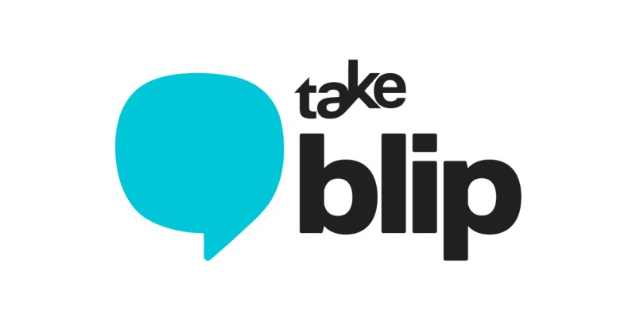
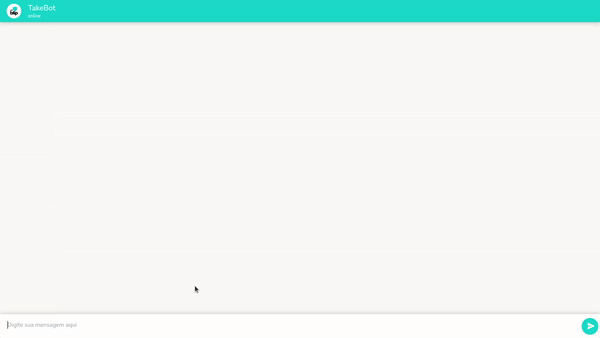

  

 

<h1 align="center">Challenge Take Blip</h1>

Challenge proposto pela empresa Take Blip

<h2>Objetivo</h2>

Elaborar um fluxo conversacional em um chatbot na plataforma da Take Blip e em conjunto desenvolver uma API para o fornecimento de dados para o chatbot

  

<h2>Detalhes da elaboração</h2>

A API foi desenvolvida utilizando-se do modelo de camadas MSC(model, service e controller), em que a camada model é a responsável por fazer as requisições dos dados, seja a um banco de dados ou outra API(o caso deste desafio), fornecendo os dados para as demais. A camada service é a responsável pelas regras/lógica de negócio. E por fim, a camada controller, que é a camada responsável por receber as requisições feitas à API.

<h2>Principais tecnologias utilizadas</h2>

* JavaScript

* Node.js

* Express.js

* Heroku

* Node-fetch